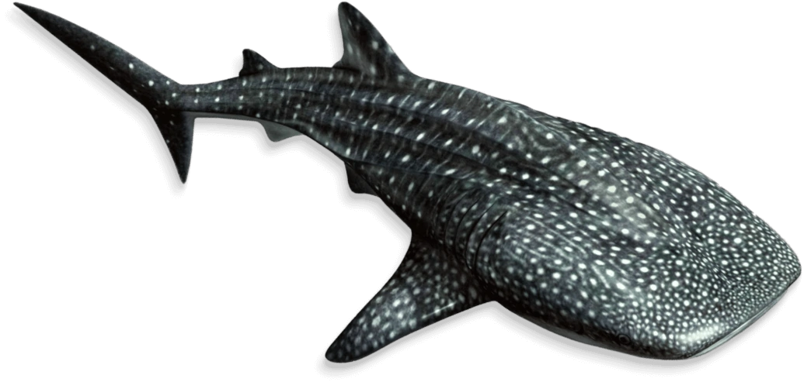

# Whale shark (<em>Rhincodon typus</em>) energetics model

 
 
A stochastic energetics model (along with an associated global sensitivity analysis) to estimate the probability of meeting the energetic needs of whale sharks at a food-provisioned tourist site. 
 
Prof <a href="https://globalecologyflinders.com/people/#DIRECTOR">Corey J. A. Bradshaw</a>  
<a href="http://globalecologyflinders.com" target="_blank">Global Ecology</a> | <em><a href="https://globalecologyflinders.com/partuyarta-ngadluku-wardli-kuu/" target="_blank">Partuyarta Ngadluku Wardli Kuu</a></em>, <a href="http://flinders.edu.au" target="_blank">Flinders University</a>, Adelaide, Australia  
October 2022 / updated February 2023 
<a href=mailto:corey.bradshaw@flinders.edu.au>e-mail</a>  
 
model co-developed by <a href="https://www.researchgate.net/profile/Christine-Barry-4">Christine Barry</a>, <a href="https://researchnow.flinders.edu.au/en/persons/charlie-huveneers-2">Charlie Huveneers</a> & <a href="http://profiles.murdoch.edu.au/myprofile/adrian-gleiss/">Adrian Gleiss</a> 
 
accompanies paper: 
<a href="https://www.researchgate.net/profile/Christine-Barry-4">BARRY, C</a>, C LEGASPI, <a href="https://scholar.google.com/citations?user=FsRAsHcAAAAJ&hl=en">TM CLARKE</a>, <a href="https://www.researchgate.net/profile/Gonzalo-Araujo">G ARAUJO</a>, <a href="https://globalecologyflinders.com/people/#DIRECTOR">CJA BRADSHAW</a>, <a href="http://profiles.murdoch.edu.au/myprofile/adrian-gleiss/">AC GLEISS</a>, <a href="https://researchnow.flinders.edu.au/en/persons/lauren-meyer">L MEYER</a>, <a href="https://researchnow.flinders.edu.au/en/persons/charlie-huveneers-2">C HUVENEERS</a>. 2023. <a href="10.1016/j.biocon.2023.110164">Estimating the energetic cost of whale shark tourism</a>. <em>Biological Conservation</em> doi:10.1016/j.biocon.2023.110164
 

## Abstract 

Wildlife tourism is one of the fastest-growing sectors of the tourism industry, where feeding animals is often applied to increase the probability of up-close encounters. However, directly feeding wildlife can cause behavioural, ecological, and physiological changes in the target species. In <a href="https://www.google.com.au/maps/place/Oslob+Whale+Shark+Watching/@9.4633642,123.3775451,17z/data=!4m12!1m6!3m5!1s0x33ab744452b80907:0x443d13a88e1123d7!2sOslob+Whale+Shark+Watching!8m2!3d9.4633589!4d123.3797338!3m4!1s0x33ab744452b80907:0x443d13a88e1123d7!8m2!3d9.4633589!4d123.3797338">Oslob</a> (Philippines), whale shark (<em>Rhincodon typus</em>) tourism involves feeding sharks a total of 150–400 kg sergestid shrimp daily across the aggregation from 06:00 to ∼ 10:00 from small outrigger boats while tourists observe whale sharks. Such feeding modifies resident whale shark behaviour, including increased residency and time engaged in vertical feeding. However, it is unclear whether such changes compromise the fitness of these individuals. We quantified changes in whale shark activity through the measurement of acceleration (a proxy for energy expenditure) to quantify the implications of tourism on the energy budget of whale sharks. We deployed tri-axial acceleration loggers on 16 whale sharks and recorded 270 hours of acceleration, depth, and water temperature data (0.2–69.7 h). Comparing activity across tourism and non-tourism periods, whale sharks had a two-fold increase in vectorial dynamic-body acceleration and altered tailbeat frequency and amplitude when fed by operators. This was likely caused by the need to manoeuvre around other sharks and feeding boats in the tourism area. Using a bioenergetics model, we show that whale shark metabolic rates increased by ~ 70% in response to occupying the tourism area. Despite the substantial increase in energy expenditure, the quantity and nominal energy density of the provisioned food likely compensates for the increased metabolic costs (depending on shark density and amount of supplementary food provided), suggesting that average feeding trends have minimal impacts on whale shark energetics. Our findings highlight the importance of quantifying the physiological impacts of tourism and feeding. 
 

## References for parameter values cited in the script

- Araujo G, <em>et al</em> . 2020. <a href="https://www.nature.com/articles/s41598-020-73416-2">Changes in diving behaviour and habitat use of provisioned whale sharks: implications for management</a>. <em>Scientific Reports</em> 10:1-12
- Araujo G, <em>et al</em>. 2014. <a href="https://peerj.com/articles/543/">Population structure and residency patterns of whale sharks, <em>Rhincodon typus</em>, at a provisioning site in Cebu, Philippines</a>. <em>PeerJ</em> 2:e543-e543
- Hsu H, Joung S, Liu K. 2012. <a href="https://onlinelibrary.wiley.com/doi/10.1111/j.1095-8649.2012.03234.x">Fisheries, management and conservation of the whale shark <em>Rhincodon typus</em> in Taiwan</a>. <em>Journal of Fish Biology</em> 80:1595-1607
- Legaspi, C, <em>et al</em>. 2020. <a href="https://royalsocietypublishing.org/doi/10.1098/rsos.200392">In-water observations highlight the effects of provisioning on whale shark behaviour at the world's largest whale shark tourism destination</a>. <em>Royal Society Open Science</em> 7:200392
- Motta PJ, Maslanka M, Hueter RE, Davis RL, De la Parra R, Mulvany SL, Habegger ML, Strother JA, Mara KR, Gardiner JM. 2010. <a href="https://www.sciencedirect.com/science/article/abs/pii/S0944200610000486">Feeding anatomy, filter-feeding rate, and diet of whale sharks <em>Rhincodon typus</em> during surface ram filter feeding off the Yucatan Peninsula, Mexico</a>. <em>Zoology</em> 113:199-212

## Sea-surface temperatures

- Average monthly sea-surface temperatures between January 2019 and August 2022 (provided in the <a href="https://github.com/cjabradshaw/WhaleSharkEnergeticsModel/tree/main/data"><em>data</em></a> subfolder) obtained from the National Oceanographic and Atmospheric Administration (NOAA) <a href="http://www.ncei.noaa.gov/products/optimum-interpolation-sst">Optimum Interpolation SST V2 database</a> at a temperature interval = 0.5 °C in the area bounded by 0–20° N, 110–130° W

   &nbsp; &nbsp; 

